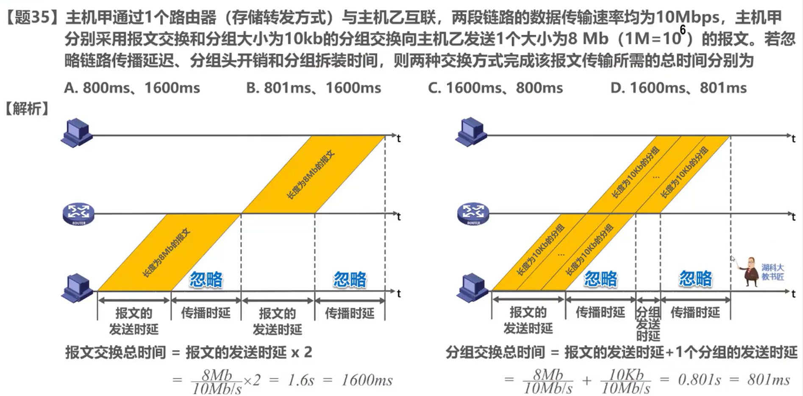
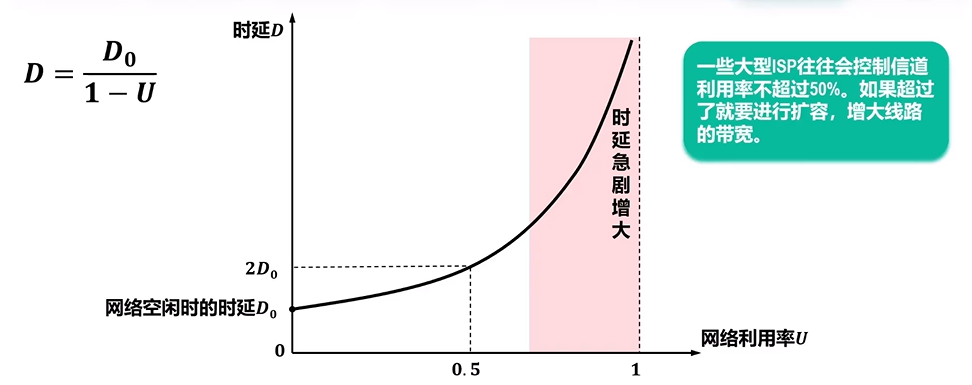

# 因特网概述
网络：由节点（node）和链路（link）组成
互联网：网络之间用路由器互连，若干个网络通过多个路由器互连起来成为互联网（互连网），也就是网络的网络
因特网（internet）是世界上最大的互联网（Internet），基于ISP的多层次结构的互连网络
因特网服务提供者（ISP），通过ISP接入因特网，个人用户也可以成为ISP
标准化：面向公众任何人，成为标准之前以RFC（请求评论）技术文档的形式发表
组成：核心部分（路由器和异构型网络，提供连通性和数据交换）与边缘部分（电脑，手机，服务器等用户设备，称为主机，用户直接使用）
# 电路交换、分组交换和报文交换
## 电路连接

计算机之间的数据传送是突发式的，不适合使用电路交换
## 分组交换
将较长的报文分割成若干个较小数据段，并且添加首部（包含了目的地址）

优点：
- 没有建立连接和释放连接的过程
- 传输过程中逐段占用通信链路，有较高的通信链路利用率
- 交换节点可以为每一个分组独立选择转发路由，有很好的生存性
缺点：
- 分组首部带来了额外的传输开销
- 交换节点存储转发分组会造成一定的时延
- 无法确保通信时端到端通信资源全部可用，可能造成网络堵塞
- 分组可能会出现失序和丢失等问题

## 报文交换

- 是分组交换的前身
- 报文被整个发送
- 交换节点要整体接收完成后才能转发到下一个节点
- 转发时延要更长，缓存空间也要求更大

## 三种交换方式的对比

报文交换和分组交换都不需要建立连接，适合计算机的突发式的数据传送

## 例题

# 计算机网络的定义和分类

互连，自治的计算机集合。可编程的硬件和各类应用
分类：
- 交换方式：电路交换，分组交换，报文交换
- 使用者：公用网，专用网
- 传输介质： 有线网络，无线网络
- 覆盖范围：广域网（WAN），城域网（MAN），局域网（LAN），个域网（PAN）
- 拓扑排序：总线型，星型，环形，网状形

# 计算机网络的性能指标

速率：

数据量和速率单位的数值并不相同！
带宽：

吞吐量：

时延：
指数据从网络的一端传送到另一端所消耗的时间，也称为延迟或者迟延

例题如下：

 传播时延和发送时延不一定哪个是主导！

时延带宽积：是传播时延和带宽的乘积，也称为以比特为单位的链路长度

往返时间（RTT）：
从发送端发送数据分组开始，到发送端收到接收端发来的相应确认分组为止，总消耗的时间

利用率：
- 链路利用率：指某条链路有百分之几的时间是被利用的（完全空闲的链路利用率为零）
- 网络利用率：指网络中所有链路的链路利用率的加权平均

丢包率：
在一定的时间范围内，传输过程中丢失的分组数量与总分组数量的比率

# 计算机网络体系结构
## 常见的三种计算机网络体系结构

## 分层的必要性

- 应用层：解决通过应用进程的交互来实现特定网络应用的问题
- 表示层：解决通信双方交换信息的表示问题（数据有关）
- 会话层：解决进程之间进行会话问题
- 运输层：解决进程之间基于网络的通信问题
- 网络层：解决数据包在多个网络之间传输和路由的问题
- 数据链路层：解决数据包在一个网络或一段链路上传输的问题
- 物理层：解决使用何种信号来表示比特0和1的问题

## 分层思想举例

## 专用术语
实体：
任何可发送或接受信息的硬件或软件进程
对等实体是指通信双方相同层次中的实体
协议：
控制两个对等实体在”水平方向“进行”逻辑通信“的规则的集合
协议三要素
- 语法：定义所交换信息的格式
- 语义：定义通信双方所要完成的操作
- 同步：定义通信双方的时序关系

服务：
在协议的控制下，两个对等实体在水平方向的逻辑通信使得本层能够向上一层提供服务

在同一系统中相邻两层的实体交换信息的逻辑接口称为服务访问点SAP，用于区分不同的服务类型
上层要使用下层提供的服务，必须通过与下层交换命令，这些命令称为服务原语

